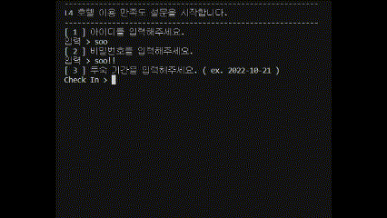
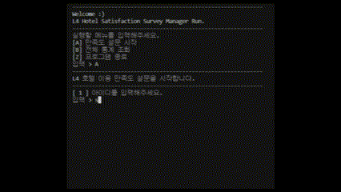

## L4 Hotel Survey
   

  

 
 

### 🔗라이브
[L4 Hotel Survey_Live](https://www.youtube.com/watch?v=vOxSoL28oqM)  

### ✈️ 소개
L4 Hotel Survey 은 L4호텔의 서비스 품질향상을 위해 설문조사 및 통계 기능을 가지고 있습니다.
실제 L4 Hotel에 방문하게 된 방문자들을 대상으로 ID,PW,CheckIN-OUT 방문자 유효성 검증을 통해 1:1 설문 서비스를 제공합니다.

### 🤖 프로젝트 성격 (동기와 기간)
KH정보교육원 강남 에서 우리에게 처음으로 주어진 Survey_Project!   
처음 예시로 주어진 Survey는 ID/PW가 존재하지 않는 단순 만족도 조사였으나 저희팀은 유효성 검사가 이루어져 중복이 없는 Survey를 통계낼 수 있도록 개발한다면  
'악성 설문자의 어뷰징을 방지할 수 있고, 더 정확한 조사가 이루어지지 않을까?' 라는 생각을 가지고 접근했습니다.  
이런 접근성에 따라 저희팀은 소비자에게 1:1로 설문지를 받아 서비스 향상이 필요한 ITEM을 구상하게 되었으며 여러가지 주제와 아이디어가 나왔으나 투표를 통해 'HOTEL'로 만장일치 되었답니다.  
여담이지만 처음 화면정의서를 구상하며 이호텔의 불만은 '춥다'로 써놓고 시작하게 되었습니다.  
추운 겨울의 대표적인 것은 많겠지만 겨울왕국의 '엘사' 여왕이 제일먼저 떠올라서 호텔이름은'L4 HOTEL'이 되었습니다.

### 🛠 기능 요약
1. 실제 L4호텔에 방문한 고객의 유효성 검증을 위해 ID/PW/Check_IN-OUT 일치여부를 확인 후 설문이 진행됩니다. 
2. 통계 선택 시 실제 방문자의 모든 문답을 통계하여 실제 서비스 만족도를 한눈에 확인할 수 있습니다.
3. 유효성 검사를 통해 1:1 설문 서비스만을 제공합니다.(중복 설문 방지)

### ⏰ 개발 기간
2022년 10월 21일 ~ 2022년 10월 27일  

### 👩‍💻 멤버 구성 및 한줄 설명
- 하성수(팀장) - 우리팀의 ACE🤴 프로젝트의 모든 기능을 마스터한 팀장님! 모든 기능의 문제점을 캐치하고, 개발, 팀의 전체적인 목표와 협업을 제일 우선시합니다!
- 진보경 - 통계전문가👩‍💻 프로젝트의 가장 핵심이라고 할 수 있는 통계기능을 담당으로 개발, 우리팀 DB관리 마스터!
- 김현정 - 문제가 없다면 설문을 할 수 없겠죠? 🤖 설문의 메뉴 및 문항을 개발하고 예외상황을 CHECK 합니다!

### 📌 기술
- Java, MySQL
- eclipse, VisualStudioCode, git

### 화면 정의서
- [화면정의서](./Final/%ED%99%94%EB%A9%B4%EC%A0%95%EC%9D%98%EC%84%9C_%EC%96%B4_!%EA%B8%88%EC%A7%80%EC%A1%B0.pdf)  : 출력화면을 나타내 놓은 문서  

### 요구사항 정의서
- [요구사항 정의서](./Final/%EC%9A%94%EA%B5%AC%EC%82%AC%ED%95%AD%20%EC%A0%95%EC%9D%98%EC%84%9C_%EC%96%B4_!%EA%B8%88%EC%A7%80%EC%A1%B0%20.pdf)  :  서비스에 구현될 기능 정의

### ERD  
- [ERD](./Final/ERD_Final.png)  

### SRC  
- [Controller](./src/kh/survey/controller/Controller.java)  
- [Model](./src/kh/survey/model/Model.java)  
- [Run](./src/kh/survey/view/Run.java)  

### SQL
- [Create Table](./SQLs/Create.sql)  
- [Insert](./SQLs/Insert_data.sql)  
