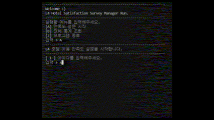

## 🏨L4 Hotel Survey🏨  
     
### 👻Project Team NAME : 어?! 금지조
-----------------------
### ✈️ 소개  
L4 Hotel Survey 은 L4호텔의 서비스 품질향상을 위해 설문조사 및 통계 기능을 가지고 있습니다.
실제 L4 Hotel에 방문하게 된 방문자들을 대상으로 ID,PW,CheckIN-OUT 방문자 유효성 검증을 통해 1:1 설문 서비스를 제공합니다.  

### 🛠 기능 요약  
1. 실제 L4호텔에 방문한 고객의 유효성 검증을 위해 ID/PW/Check_IN-OUT 일치여부를 확인 후 설문이 진행됩니다. 
2. 통계 선택 시 실제 방문자의 모든 문답을 통계하여 실제 서비스 만족도를 한눈에 확인할 수 있습니다.  
3. 유효성 검사를 통해 1:1 설문 서비스만을 제공합니다.(중복 설문 방지)  
-----------------------
### ⏰ 개발 기간
2022년 10월 21일 ~ 2022년 10월 27일  

### 📌 기술
Java, MySQL  
eclipse, VisualStudioCode, git  

### [어?! 금지조 멤버 한줄 소개]  
   
### 👨‍💻하성수(팀장)  
ERD, 화면정의서,  요구사항정의서 작성, 최종검토, ID_checkIN 유효성검사 코드 작성, INSERT 코드 작성,전체적인 코드 관리, 발표  
### 👩‍💻진보경  
ERD , 화면 정의서,  요구사항정의서 작성,통계 산출 코드 작성,PPT 작성  
### 👩‍💻김현정  
ERD, 화면정의서, 요구사항정의서 작성,menu 코드 작성,GIT 정리  

-----------------------
### 🔗라이브 영상  
- [L4 Hotel Survey_Live](https://www.youtube.com/watch?v=vOxSoL28oqM)  
  
### 💻CodeArchitecture  
- [CodeArchitecture](./refers/img/3.png)  

### ⚙️기능 구현 화면  

- Survey 진행_오입력 방지    
  

- 조회기능      
  

- 중복설문방지기능(CheckIN_OUT유효성검사)  
  

- 날짜오입력방지(패턴)  
 

- ID/PW유효성검사]  
 

-----------------------

### 화면 정의서
- [화면정의서](./Final/%ED%99%94%EB%A9%B4%EC%A0%95%EC%9D%98%EC%84%9C_%EC%96%B4_!%EA%B8%88%EC%A7%80%EC%A1%B0.pdf)  

### 요구사항 정의서
- [요구사항 정의서](./Final/%EC%9A%94%EA%B5%AC%EC%82%AC%ED%95%AD%20%EC%A0%95%EC%9D%98%EC%84%9C_%EC%96%B4_!%EA%B8%88%EC%A7%80%EC%A1%B0%20.pdf)  

### ERD  
- [ERD](./Final/ERD_Final.png)  

### SRC  
- [Controller](./src/kh/survey/controller/Controller.java)  
- [Model](./src/kh/survey/model/Model.java)  
- [Run](./src/kh/survey/view/Run.java)  

### SQL
- [Create Table](./SQLs/Create.sql)  
- [Insert](./SQLs/Insert_data.sql)  

-----------------------
### 🤖 프로젝트 성격 (동기)
 KH정보교육원 강남 에서 우리에게 처음으로 주어진 Survey_Project!😎   
처음 예시로 주어진 Survey는 ID/PW가 존재하지 않는 단순 만족도 조사였으나 저희팀은 유효성 검사가 이루어져 중복이 없는 Survey를 통계낼 수 있도록 개발한다면'악성 설문자의 어뷰징을 방지할 수 있고, 더 정확한 조사가 이루어지지 않을까?' 라는 생각을 가지고 접근했습니다.  
이런 접근성에 따라 저희팀은 소비자에게 1:1로 설문지를 받아 서비스 향상이 필요한 ITEM을 구상하게 되었으며 여러가지 주제와 아이디어가 나왔으나 투표를 통해 'HOTEL'로 만장일치 되었습니다.

### 🐤 에피소드 및 느낀점
사실 프로젝트를 하기 이전에는 자신의 개발 실력을 혼자서는 절대 알 수 가 없는 것 같습니다. 팀원들과 협업하며 내가 모르는 것, 그리고 내가 못하는 것, 내가 잘하는 것을 알아갈 수 있는 계기가 되었습니다.  특히 협업을 하며 Git관리와 코드리뷰에대해 더 깊히 습득할 수 있는 계기가 되었던 것 같습니다. 

-----------------------